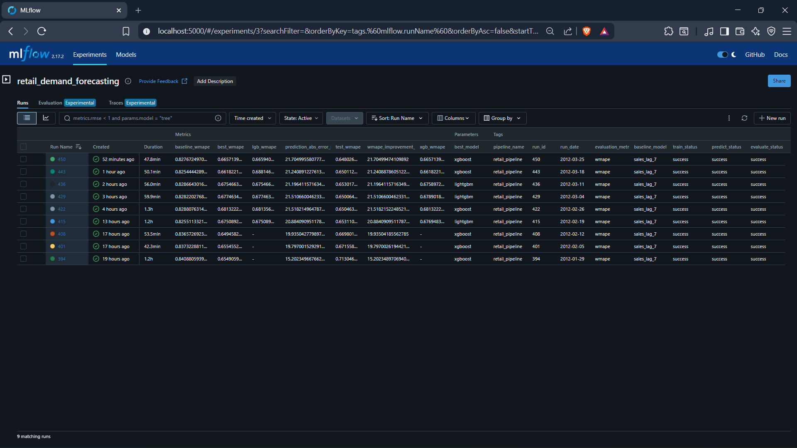
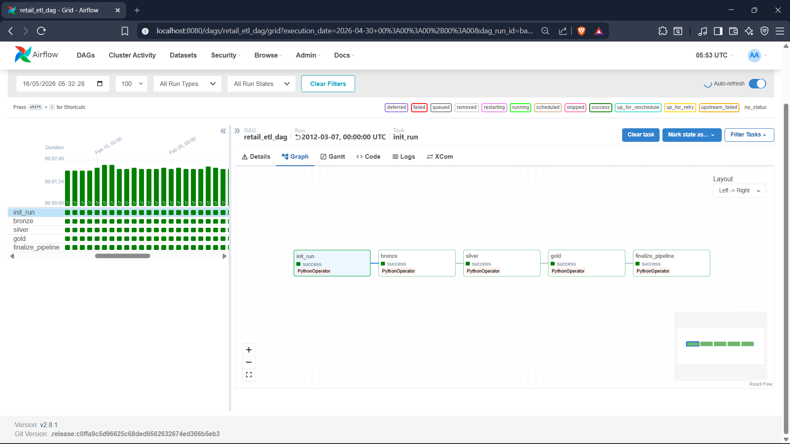
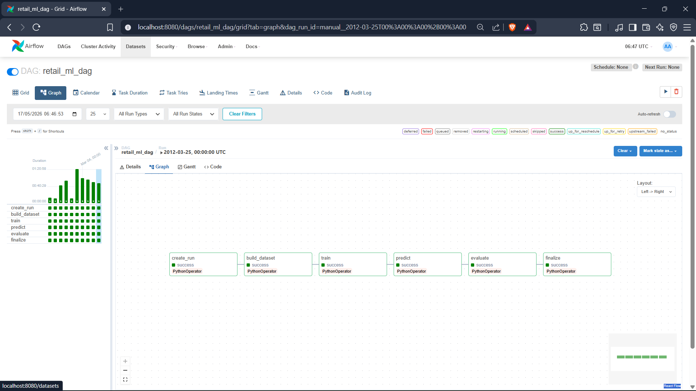
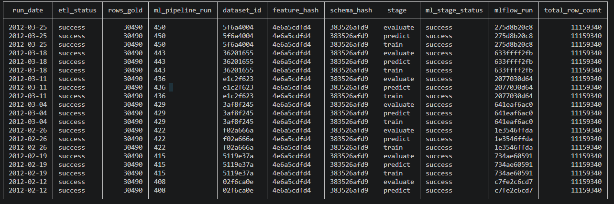

# Data-Pipeline-ETL-ML

A production-grade **Airflow-based ETL + ML pipeline** for retail demand forecasting using the M5 dataset. Implements medallion architecture (Bronze/Silver/Gold), metadata-driven ML orchestration, reproducible dataset versioning, and MLflow-based experiment tracking.

Built to simulate a production-style batch ML platform focused on orchestration, lineage, reproducibility, and operational reliability rather than notebook-centric experimentation.

**Focus:** End-to-end ML lineage from raw CSV ingestion → warehouse transformations → dataset generation → model training → batch prediction → evaluation.

---
## System Guarantees

- Idempotent and reproducible partition-based pipeline execution
- Deterministic train/validation/test dataset generation
- End-to-end metadata lineage across datasets, models, predictions, and evaluations
- Execution-date scoped reproducibility for ETL and ML workflows
- Validation-driven data quality enforcement using Pandera
- Experiment and artifact tracking through MLflow

---

## Architecture Diagram


---

## Results 

### Pipeline Scale

| Metric | Value |
|---|---|
| Raw Rows Processed | 11M+ |
| ML Dataset Rows Generated | 11.1M+ |
| Prediction Rows Generated | 1.67M+ |
| Forecasting Models | XGBoost, LightGBM |
| Storage Formats | Parquet, LibSVM |

### Forecasting Performance

| Metric | Model | Baseline |
|---|---|---|
| RMSE | 2.01 | 2.81 |
| MAE | 0.67 | 0.86 |
| WMAPE | 0.648 | 0.828 |
| R² Score | 0.759 | — |

The forecasting pipeline consistently achieved a **20.0% WMAPE improvement** over the lag-based baseline forecasting strategy.




---

## Tech Stack

| Layer | Technologies |
|---|---|
| Orchestration | Apache Airflow |
| Data Warehouse & Metadata | PostgreSQL |
| ETL & Validation | SQL, Pandera |
| ML & Feature Engineering | scikit-learn, XGBoost, LightGBM, pandas |
| Experiment Tracking | MLflow |
| Storage Formats | Parquet, LibSVM |
| Infrastructure | Docker, Docker Compose |
| Monitoring | Airflow UI, MLflow UI |

---

## Dataset 

This project uses the **M5 Forecasting Dataset** from the Walmart retail forecasting competition on Kaggle.

[M5 Forecasting Dataset (Kaggle)](https://www.kaggle.com/competitions/m5-forecasting-accuracy?utm_source=chatgpt.com)

---

## Key Features

- Production-style Airflow orchestration for ETL and ML workflows
- Medallion architecture (Bronze → Silver → Gold) using PostgreSQL
- Idempotent and reproducible partition-based pipeline execution
- SQL-first warehouse transformations with validation-driven data quality checks
- Deterministic train/validation/test dataset generation and snapshot versioning
- Feature engineering with lag, rolling-window, temporal, and categorical features
- XGBoost and LightGBM forecasting with MLflow experiment tracking
- Batch prediction and evaluation using RMSE, MAE, WMAPE, and R² metrics
- End-to-end metadata lineage across datasets, models, predictions, and evaluations
- Dockerized infrastructure with centralized tracking, logging, and monitoring

---

## Project Structure

```
Data-Pipeline-ETL-ML/
├── dags/          # Airflow DAG orchestration
├── ETL/           # Bronze → Silver → Gold ETL pipeline
├── ML/            # Training, prediction, evaluation pipeline
├── utils/         # Shared helpers and metadata lifecycle utilities
├── schema/        # Warehouse and metadata schemas
├── requirements/  # Dependency management
├── docker/        # Container configuration
├── docker-compose.yml
└── README.md
```
---

## ETL Pipeline (`etl_dag.py`)

### DAG Flow

```text
init_run → bronze → silver → gold → finalize_pipeline
```

The ETL workflow ingests raw M5 datasets into PostgreSQL, performs Bronze → Silver → Gold transformations, validates schema integrity using Pandera, and generates business-ready feature tables for downstream ML workloads.



---

## ML Pipeline (`ml_dag.py`)

### DAG Flow

```text
create_run → build_dataset → train → predict → evaluate → finalize
```

The ML workflow builds deterministic train/validation/test datasets, performs gradient boosting model training, generates batch predictions, evaluates forecasting performance, and tracks experiments and artifacts through MLflow.



---

## Metadata & Lineage Tracking

The pipeline maintains end-to-end lineage across ETL runs, dataset generation, ML stages, and MLflow experiment tracking using PostgreSQL-backed metadata tables.



---

## Configuration

Environment variables are managed through `.env` and Docker Compose configuration.

Core services include:
- PostgreSQL
- Apache Airflow
- MLflow

Dataset and warehouse paths can be configured through environment variables inside the containerized deployment setup.

## Running the Pipeline

### Prerequisites
- Docker & Docker Compose
- Python 3.9+
- M5 dataset files inside `data/`

### Quick Start

```bash
git clone https://github.com/Vibhor61/Data-Pipeline-ETL-ML.git
cd Data-Pipeline-ETL-ML

docker-compose up -d
```

### Access Services

| Service | URL |
|---|---|
| Airflow UI | http://localhost:8080 |
| MLflow UI | http://localhost:5000 |

Default Airflow credentials:

```text
airflow / airflow
```

### Trigger Pipelines

Access Airflow Container:

```bash
docker exec -it airflow_scheduler bash
```

ETL Pipeline:

```bash
airflow dags trigger retail_etl_dag --exec-date 2011-01-29
```

ML Pipeline:

```bash
airflow dags trigger retail_ml_dag --exec-date 2012-01-29
```

### Notes
- Historical data ranges from `2011-01-29` to `2016-04-24`
- During initial bootstrap, `calendar.csv` and `sell_prices.csv` are ingested through the Bronze layer
- ML DAG execution depends on a completed ETL run for the same execution date
---

## Future work and improvements

- Hyperparameter optimization pipeline
- CI/CD integration for automated testing and deployment
- Real-time inference pipeline
- Data drift and model drift monitoring
- Online feature store integration
- Distributed model training
- Monitoring dashboards and alerting using Grafana and Prometheus

---
